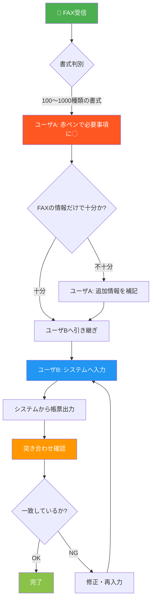
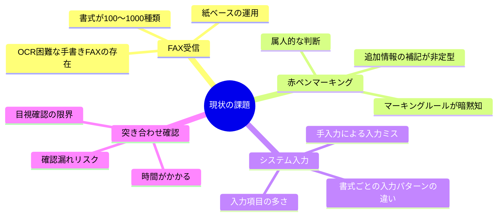
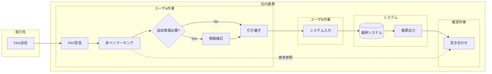

# 業務フロー可視化

## 全体フロー図

## 業務ステップ詳細

### Step 1: FAX受信
| 項目 | 内容 |
|------|------|
| 入力 | 取引先からのFAX |
| 書式数 | 100〜1,000種類（会社ごとに異なる） |
| 課題 | 書式が統一されていないため、項目の位置・形式がバラバラ |

### Step 2: 赤ペンマーキング（ユーザA）
| 項目 | 内容 |
|------|------|
| 担当 | ユーザA |
| 作業内容 | FAXの必要事項に赤ペンで◯を付ける |
| 判断 | どの項目が必要かはユーザAの知識・経験に依存 |
| 追加作業 | FAX情報が不十分な場合、追加情報を補記してユーザBに引き継ぐ |

### Step 3: システム入力（ユーザB）
| 項目 | 内容 |
|------|------|
| 担当 | ユーザB |
| 作業内容 | 赤ペンで◯された項目をシステムに入力 |
| 入力元 | 赤ペン付きFAX + ユーザAの補記情報 |

### Step 4: 突き合わせ確認
| 項目 | 内容 |
|------|------|
| 作業内容 | システム出力帳票 vs 赤ペン付きFAXの目視比較 |
| 目的 | 入力ミスの検出 |
| 課題 | 人力による確認のため、見落としリスクあり |

## 現状の課題マップ

## データフロー図

