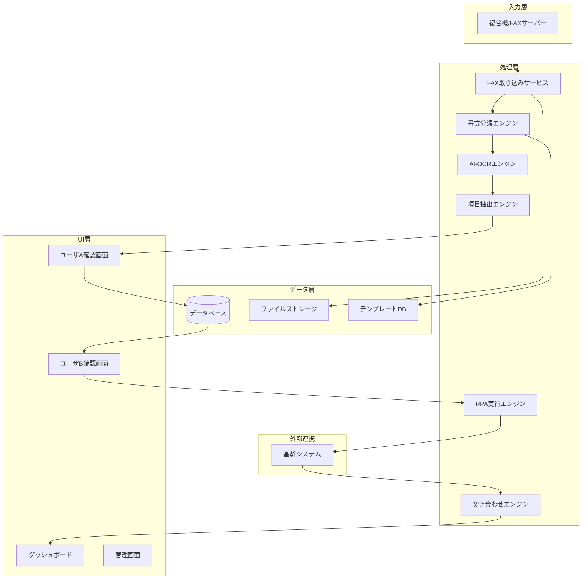

# RPA システム要件定義書

## 1. プロジェクト概要

### 1.1 目的
FAX受信から基幹システム入力・突き合わせ確認までの業務を自動化・効率化し、人的ミスの削減と処理速度の向上を実現する。

### 1.2 対象業務
取引先からのFAX受信 → 必要事項の抽出 → システム入力 → 突き合わせ確認

### 1.3 現状の課題
| # | 課題 | 影響 |
|---|------|------|
| 1 | FAX書式が100〜1,000種類と多様 | 自動読み取りが困難 |
| 2 | 赤ペンマーキングが属人的判断 | ユーザAの不在時に業務停滞 |
| 3 | 手入力によるシステム登録 | 入力ミス・処理時間の増大 |
| 4 | 目視による突き合わせ確認 | 確認漏れリスク |
| 5 | FAX情報の不足時に追加補記が必要 | 非定型作業で標準化困難 |

---

## 2. システム要件

### 2.1 機能要件

#### F-01: FAX電子化・取り込み機能
| 項目 | 内容 |
|------|------|
| 概要 | 受信FAXをデジタルデータ（画像/PDF）として取り込む |
| 要件 | - 複合機またはFAXサーバーからの自動取り込み - 受信日時・送信元番号の自動記録 - 取り込み後の一覧管理画面 |
| 優先度 | 必須 |

#### F-02: AI-OCR（文字認識）機能
| 項目 | 内容 |
|------|------|
| 概要 | FAX画像から文字情報を自動抽出する |
| 要件 | - 活字・手書き両対応のOCR - 100〜1,000種類の書式に対応するテンプレート管理 - 新規書式の学習・登録機能 - 認識精度のしきい値設定（低信頼度の項目はフラグ付与） |
| 技術候補 | Azure AI Document Intelligence / Google Document AI / AWS Textract |
| 優先度 | 必須 |

#### F-03: 書式分類・テンプレートマッチング機能
| 項目 | 内容 |
|------|------|
| 概要 | 受信FAXの書式を自動判別し、適切な読み取りテンプレートを適用する |
| 要件 | - 送信元FAX番号による自動分類 - 画像特徴量による書式分類（レイアウト解析） - 未知の書式の検出とエスカレーション - テンプレートの追加・編集UI |
| 優先度 | 必須 |

#### F-04: 項目抽出・ハイライト機能（赤ペン代替）
| 項目 | 内容 |
|------|------|
| 概要 | ユーザAの赤ペンマーキング作業をデジタル化する |
| 要件 | - テンプレートに基づく必要項目の自動抽出 - 抽出結果の画面上ハイライト表示 - ユーザAによる確認・修正UI - 抽出項目の承認ワークフロー |
| 優先度 | 必須 |

#### F-05: 情報補記・追加入力機能
| 項目 | 内容 |
|------|------|
| 概要 | FAX情報だけでは不十分な場合に、ユーザAが追加情報を入力できる |
| 要件 | - FAX項目に対する補足情報入力フォーム - 補記が必要な項目のフラグ管理 - 補記内容のユーザBへの引き継ぎ表示 - 補記履歴の保存 |
| 優先度 | 必須 |

#### F-06: 基幹システム自動入力（RPA）機能
| 項目 | 内容 |
|------|------|
| 概要 | 抽出・確認済みデータを基幹システムへ自動入力する |
| 要件 | - 基幹システムへの自動データ投入 - 入力前のユーザB確認画面 - 入力項目のマッピング設定（書式ごと） - エラー時のリトライ・通知機能 - 入力ログの記録 |
| 技術候補 | UiPath / Power Automate / 基幹システムAPI連携 |
| 優先度 | 必須 |

#### F-07: 自動突き合わせ確認機能
| 項目 | 内容 |
|------|------|
| 概要 | 基幹システム出力とFAX原本（抽出データ）の自動照合 |
| 要件 | - システム出力データ vs OCR抽出データの自動比較 - 不一致箇所のハイライト表示 - 差分レポートの生成 - 不一致時の修正ワークフロー |
| 優先度 | 必須 |

#### F-08: ダッシュボード・進捗管理機能
| 項目 | 内容 |
|------|------|
| 概要 | 業務全体の進捗状況を可視化する |
| 要件 | - FAX処理ステータスの一覧表示（未処理/処理中/完了/差戻し） - 担当者ごとのタスク管理 - 処理件数・エラー率の統計 |
| 優先度 | 推奨 |

---

### 2.2 非機能要件

#### NF-01: パフォーマンス
| 項目 | 基準 |
|------|------|
| OCR処理時間 | 1枚あたり30秒以内 |
| 書式分類 | 1枚あたり5秒以内 |
| 同時処理数 | 最低10件の並行処理 |

#### NF-02: 精度
| 項目 | 基準 |
|------|------|
| OCR認識率（活字） | 99%以上 |
| OCR認識率（手書き） | 95%以上 |
| 書式分類精度 | 98%以上 |
| 突き合わせ検出率 | 100%（差異の見落としゼロ） |

#### NF-03: 可用性
| 項目 | 基準 |
|------|------|
| 稼働時間 | 平日 8:00〜20:00 |
| 目標稼働率 | 99.5%以上 |

#### NF-04: セキュリティ
| 項目 | 基準 |
|------|------|
| アクセス制御 | ロールベース（ユーザA/ユーザB/管理者） |
| データ保護 | FAXデータの暗号化保存 |
| 監査ログ | 全操作の記録 |

#### NF-05: 拡張性
| 項目 | 基準 |
|------|------|
| 書式テンプレート | 1,000種類以上に対応可能な設計 |
| 新規書式追加 | 管理画面から追加可能（開発不要） |

---

## 3. システム構成案

---

## 4. 段階的導入計画

### Phase 1: 基盤構築（1〜2ヶ月）
- FAX電子化・取り込み機能の構築
- 頻出書式（上位20種類）のテンプレート作成
- AI-OCRの選定・PoC実施

### Phase 2: 自動化コア（2〜3ヶ月）
- 書式自動分類機能の実装
- 項目抽出・ハイライト機能の実装
- ユーザA/B向け確認画面の開発
- 情報補記機能の開発

### Phase 3: RPA連携（1〜2ヶ月）
- 基幹システムとのRPA連携開発
- 自動突き合わせ機能の開発
- エラーハンドリング・通知機能

### Phase 4: 最適化・拡張（継続）
- テンプレート拡充（全書式対応）
- AI学習モデルの精度向上
- ダッシュボード・統計機能の追加
- 未知書式の自動学習機能

---

## 5. リスクと対策

| リスク | 影響度 | 対策 |
|--------|--------|------|
| OCR精度が不十分 | 高 | 人間によるレビュー工程を残す。段階的に自動化範囲を拡大 |
| 書式数が多すぎてテンプレート管理が破綻 | 高 | AIベースの汎用抽出（LLM活用）を検討 |
| 基幹システムのUI変更によるRPA破損 | 中 | API連携を優先。RPA使用時はUI変更監視を実装 |
| ユーザの抵抗・習熟不足 | 中 | 段階的導入とトレーニング。既存業務との並行運用期間を設定 |
| FAXの画質劣化 | 中 | 画像前処理（ノイズ除去・コントラスト補正）を実装 |

---

## 6. 成功指標（KPI）

| 指標 | 現状（想定） | 目標 |
|------|-------------|------|
| 1件あたりの処理時間 | 15〜30分 | 5分以内 |
| 入力ミス率 | 2〜5% | 0.5%以下 |
| 突き合わせ確認の見落とし | 発生あり | ゼロ |
| ユーザAの赤ペン作業時間 | 5〜10分/件 | 1〜2分/件（確認のみ） |
